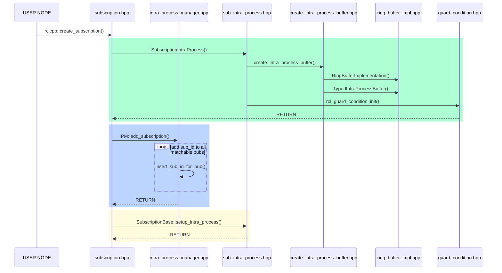
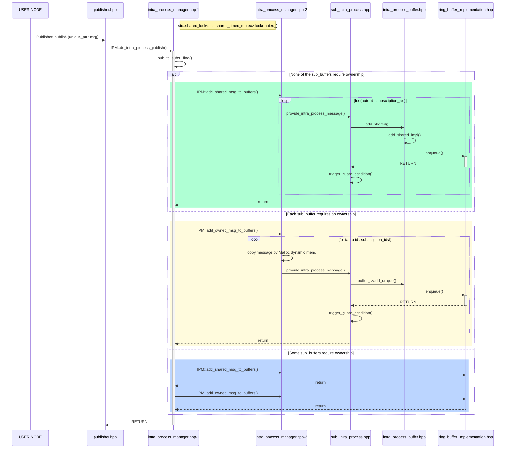
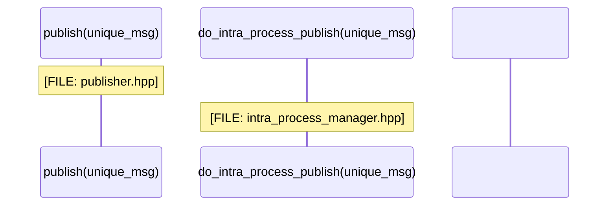

# Intra-process Communications in ROS 2

## A. Overview

### I. Motivation


### II. The general idea

The core idea is that every time a `Subscription` that uses intra-process communication is created, also an object of type `SubscriptionIntraProcess` is created.
This new object is stored in the `IntraProcessManager` and it contains a buffer where messages can be inserted from intra-process `Publisher`s.
The object itself is `rclcpp::Waitable` so it can be added to a callback group.

When a `Publisher` that uses intra-process communication publishes a message, this is passed to the `IntraProcessManager`.
This class knows how many `Subscriptions` require this message and can deliver the message to all of them, by adding it to their buffers.

### III. Simplified workflow

Consider a simple scenario, consisting of `Publisher`s and `Subscription`s all in the same process and with the durability QoS set to `volatile`. 

1. The proposed implementation creates one buffer per `Subscription`. 

   > Size ?
   >
   > Policy ?
   >
   > lock/mutex ?

2. When a message is published to a topic, its `Publisher` pushes the message into the buffer of each of the `Subscription`s related to that topic and raises a notification, waking up the executor. 

   > pushes the message into: how?? 
   >
   > raises a notification: How?? thread creation??
   >
   > waking up the executor: Who?? When?? How??

3. The executor can then pop the message from the buffer and trigger the callback of the `Subscription`.

   > pop the message from the buffer: to where?? When??
   >
   > trigger the callback: Who?? How?? When??


> The choice of having independent buffers for each `Subscription` leads to the following advantages:
>
> - It is easy to support different QoS for each `Subscription`, while, at the same time, simplifying the implementation.
> - Multiple `Subscription`s can extract messages from their own buffer in parallel without blocking each other, thus providing an higher throughput.
>
> The only **drawback** is that the system is not reusing as much resources as possible, compared to sharing buffers between entities. However, from a practical point of view, the memory overhead caused by the proposed implementation with respect to the current one, will always be only a tiny delta compared to the overall memory usage of the application.

There are three possible data-types that can be stored in the buffer:

- `MessageT`: 

- `shared_ptr<const MessageT>`

- `unique_ptr<MessageT>`

  > [shared_ptr 和 unique_ptr区别和联系](https://blog.csdn.net/MissXy_/article/details/81029794): [扩展阅读](https://blog.csdn.net/cpp_learner/article/details/118912592)
  >
  > - `shared_ptr:` 允许多个指针指向同一个对象;
  >
  > - `unique_ptr:` **独占**所指向的对象。与shared_ptr不同，某个时刻只能有一个unique_ptr指向一个给定对象。当unique_ptr被销毁时，它所指向的对象也被销毁。

## B. Details

### I. Creating a publisher

1. User calls `Node::create_publisher<MessageT>(...)`.

   > ```c++
   > [FILE: camera_node.hpp]    
   > 		...
   > 		// Create a publisher on the output topic.
   >     pub_ = this->create_publisher<sensor_msgs::msg::Image>(output, rclcpp::SensorDataQoS());
   > 		...
   > ```

2. This boils down to `NodeTopics::create_publisher(...)`, where a `Publisher` is created through the factory.

3. Here, if intra-process communication is enabled, eventual intra-process related variables are initialized through the `PublisherBase::setup_intra_process(...)` method.

   > ```c++
   > [FILE: publisher.hpp]
   >   virtual void  (
   >     rclcpp::node_interfaces::NodeBaseInterface * node_base,
   >     const std::string & topic,
   >     const rclcpp::QoS & qos,
   >     const rclcpp::PublisherOptionsWithAllocator<AllocatorT> & options)
   >   {
   > 		...
   >     // If needed, setup intra process communication.
   >     if (rclcpp::detail::resolve_use_intra_process(options_, *node_base)) {
   >       auto context = node_base->get_context();
   >       // Get the intra process manager instance for this context.
   >       auto ipm = context->get_sub_context<rclcpp::experimental::IntraProcessManager>();
   >       // Register the publisher with the intra process manager.
   > 			...
   >       uint64_t intra_process_publisher_id = ipm->add_publisher(this->shared_from_this());		// HERE!
   >       this->setup_intra_process(		// HERE!
   >         intra_process_publisher_id,
   >         ipm);
   >     }
   >   }
   > ```
   >
   > 通过`rclcpp::detail::resolve_use_intra_process`函数来判断某个node**是否启用**intra-process。
   >
   > ```c++
   > [FILE: publisher_base.hpp]
   >   /// Implementation utility function used to setup intra process publishing after creation.
   >   RCLCPP_PUBLIC
   >   void setup_intra_process(
   >     uint64_t intra_process_publisher_id,
   >     IntraProcessManagerSharedPtr ipm);
   > 
   > [FILE: publisher_base.cpp]
   > 	void PublisherBase::setup_intra_process(
   >   	uint64_t intra_process_publisher_id,
   >   	IntraProcessManagerSharedPtr ipm)
   > 	{
   >   	intra_process_publisher_id_ = intra_process_publisher_id;
   >   	weak_ipm_ = ipm;
   >   	intra_process_is_enabled_ = true;
   > 	}
   > ```
   >
   > 可以看到一个启用intra-process的publisher需要IntraProcessManager这个东西，IntraProcessManager可以通过`add_publisher`来添加相关的publisher，添加后IntraProcessManager会返回一个`uint64_t`类型的标识ID；然后通过`setup_intra_process`将创建好的publisher对象与IntraProcessManager进行关联。

4. Then the `IntraProcessManager` is notified about the existence of the new `Publisher` through the method `IntraProcessManager::add_publisher(PublisherBase::SharedPtr publisher, PublisherOptions options)`.

5. `IntraProcessManager::add_publisher(...)` stores the `Publisher` information in an internal structure of type `PublisherInfo`. The structure contains information about the `Publisher`, such as its QoS and its topic name, and a weak pointer for the `Publisher` object. An `uint64_t pub_id` unique within the `rclcpp::Context` is assigned to the `Publisher`. The `IntraProcessManager` contains a `std::map<uint64_t, PublisherInfo>` object where it is possible to retrieve the `PublisherInfo` of a specific `Publisher` given its id. The function returns the `pub_id`, that is stored within the `Publisher`.

   > ```c++
   > [intra_process_manager.cpp]
   >     uint64_t IntraProcessManager::add_publisher(rclcpp::PublisherBase::SharedPtr publisher)
   >     {
   >       std::unique_lock<std::shared_timed_mutex> lock(mutex_);
   > 
   >       auto id = IntraProcessManager::get_next_unique_id();		// SRLIU_mark1
   > 
   >       publishers_[id].publisher = publisher;									// SRLIU_mark2
   >       publishers_[id].topic_name = publisher->get_topic_name();
   >       publishers_[id].qos = publisher->get_actual_qos().get_rmw_qos_profile();
   > 
   >       // Initialize the subscriptions storage for this publisher.
   >       pub_to_subs_[id] = SplittedSubscriptions();							// SRLIU_mark3
   > 
   >       // create an entry for the publisher id and populate with already existing subscriptions
   >       for (auto & pair : subscriptions_) {
   >         if (can_communicate(publishers_[id], pair.second)) {
   >           insert_sub_id_for_pub(pair.first, id, pair.second.use_take_shared_method);		// SRLIU_mark4
   >         }
   >       }
   >       return id;
   >     }
   > ```
   >
   > **SRLIU_mark1**: `get_next_unique_id(...)`会修改原子变量`_next_unique_id`以获得唯一ID值，此值似乎是本设备上所有pub和sub共享的。
   >
   > **SRLIU_mark2**: `publishers_`是类`PublisherMap`的实例，用于存放有效的pub的部分相关信息。`PublisherMap`的定义为`using PublisherMap = std::unordered_map<uint64_t, PublisherInfo>`是一个无序图。
   >
   > **SRLIU_mark3**: `pub_to_subs_`为一个无序图，储存了一个publisher被哪些subscription订阅，SplittedSubscriptions包含两个数组，分别表示可共享订阅和独占订阅。
   >
   > **SRLIU_mark4**: 更新`pub_to_subs_`中的映射关系，这之后`pub_to_subs_[id]`应该关联了所有与这个pub相关的sub，代码实现如下：
   >
   > ```c++
   >     void IntraProcessManager::insert_sub_id_for_pub(
   >       uint64_t sub_id,
   >       uint64_t pub_id,
   >       bool use_take_shared_method)
   >     {
   >       if (use_take_shared_method) {
   >         pub_to_subs_[pub_id].take_shared_subscriptions.push_back(sub_id);
   >       } else {
   >         pub_to_subs_[pub_id].take_ownership_subscriptions.push_back(sub_id);
   >       }
   >     }
   > ```

---

### II. Creating a subscription



1. User calls `Node::create_subscription<MessageT>(...)`.

   > ```c++
   > [node_impl.hpp]
   >     std::shared_ptr<SubscriptionT>
   >     Node::create_subscription(
   >       const std::string & topic_name,
   >       const rclcpp::QoS & qos,
   >       CallbackT && callback,
   >       const SubscriptionOptionsWithAllocator<AllocatorT> & options,
   >       typename MessageMemoryStrategyT::SharedPtr msg_mem_strat)
   >     {
   >       return rclcpp::create_subscription<MessageT>(		// SRLIU_mark1
   >         *this,
   >         extend_name_with_sub_namespace(topic_name, this->get_sub_namespace()),
   >         qos,
   >         std::forward<CallbackT>(callback),
   >         options,
   >         msg_mem_strat);
   >     }
   > ```

2. `Node::create_subscription<MessageT>(...)` calls `rclcpp::create_subscription(...)`, which uses:

   > ```c++
   > [src/ros2/rclcpp/rclcpp/include/rclcpp/subscription.hpp]
   >   Subscription(
   >     rclcpp::node_interfaces::NodeBaseInterface * node_base,
   >     const rosidl_message_type_support_t & type_support_handle,
   >     const std::string & topic_name,
   >     const rclcpp::QoS & qos,
   >     AnySubscriptionCallback<CallbackMessageT, AllocatorT> callback,
   >     const rclcpp::SubscriptionOptionsWithAllocator<AllocatorT> & options,
   >     typename MessageMemoryStrategyT::SharedPtr message_memory_strategy,
   >     SubscriptionTopicStatisticsSharedPtr subscription_topic_statistics = nullptr)
   > ```

3. This boils down to `NodeTopics::create_subscription(...)`, where a `Subscription` is created through the factory.

   > ```c++
   > [node_topics.cpp]
   > 		...
   > 		return subscription_factory.create_typed_subscription(node_base_, topic_name, qos);
   > 		...
   > ```

4. Here, if intra-process communication is enabled, intra-process related variables are initialized through the `SubscriptionBase::setup_intra_process(...)` method. The most relevant ones being the ring buffer and the waitable object.

   > ```c++
   > [rclcpp/rclcpp/src/rclcpp/subscription_base.cpp]
   >     void
   >     SubscriptionBase::setup_intra_process(
   >       uint64_t intra_process_subscription_id,
   >       IntraProcessManagerWeakPtr weak_ipm)
   >     {
   >       intra_process_subscription_id_ = intra_process_subscription_id;
   >       weak_ipm_ = weak_ipm;
   >       use_intra_process_ = true;
   >     }
   > ```

5. Then the `IntraProcessManager` is notified about the existence of the new `Subscription` through the method `IntraProcessManager::add_subscription(SubscriptionBase::SharedPtr subscription, SubscriptionOptions options)`.

6. `IntraProcessManager::add_subscription(...)` stores the `Subscription` information in an internal structure of type `SubscriptionInfo`. The structure contains information about the `Subscription`, such as its QoS, its topic name and the type of its callback, and a weak pointer for the `Subscription` object. An `uint64_t sub_id` unique within the `rclcpp::Context` is assigned to the `Subscription`. The `IntraProcessManager` contains a `std::map<uint64_t, SubscriptionInfo>` object where it is possible to retrieve the `SubscriptionInfo` of a specific `Subscription` given its id. There is also an additional structure `std::map<uint64_t, std::pair<std::set<uint64_t>, std::set<uint64_t>>>`. The key of the map is the unique id of a `Publisher` and the value is a pair of sets of ids. These sets contain the ids of the `Subscription`s that can communicate with the `Publisher`. We have **two different sets** because we want to differentiate the `Subscription`s depending on whether they request ownership of the received messages or not (note that this decision is done looking at their buffer, since the `Publisher` does not have to interact with the `Subscription` callback).

   > ```c++
   > [rclcpp/rclcpp/src/rclcpp/intra_process_manager.cpp]
   >     uint64_t
   >     IntraProcessManager::add_subscription(SubscriptionIntraProcessBase::SharedPtr subscription)
   >     {
   >       std::unique_lock<std::shared_timed_mutex> lock(mutex_);		// SRLIU_mark1
   > 
   >       auto id = IntraProcessManager::get_next_unique_id();
   > 
   >       subscriptions_[id].subscription = subscription;						// SRLIU_mark2
   >       subscriptions_[id].topic_name = subscription->get_topic_name();
   >       subscriptions_[id].qos = subscription->get_actual_qos();
   >       subscriptions_[id].use_take_shared_method = subscription->use_take_shared_method();		// SRLIU_mark3
   > 
   >       // adds the subscription id to all the matchable publishers
   >       for (auto & pair : publishers_) {
   >         if (can_communicate(pair.second, subscriptions_[id])) {
   >           insert_sub_id_for_pub(id, pair.first, subscriptions_[id].use_take_shared_method);
   >         }
   >       }
   >       return id;
   >     }
   > ```
   >
   > **SRLIU_mark2**: `subscriptions_`是类`SubscriptionMap`的实例，用于存放有效的pub的部分相关信息。`SubscriptionMap`的定义为`using SubscriptionMap = std::unordered_map<uint64_t, SubscriptionInfo>;`是一个无序图。
   >
   > ```c++
   >   struct SubscriptionInfo{
   >     SubscriptionInfo() = default;
   > 
   >     rclcpp::experimental::SubscriptionIntraProcessBase::SharedPtr subscription;
   >     rmw_qos_profile_t qos;
   >     const char * topic_name;
   >     bool use_take_shared_method;
   >   };
   > ```
   >
   > **SRLIU_mark3**: 更新`pub_to_subs_`中的映射关系，这之后`pub_to_subs_[id]`应该关联了所有与这个sub相关的pub。**每个sub有一个属性即是否需要`use_take_shared_method`，用于标识这个sub与其pub源下属的其他sub之间对于pub所释放数据是共享还是独占属性。**

7. The `SubscriptionIntraProcessWaitable` object is added to the list of Waitable interfaces of the node through `node_interfaces::NodeWaitablesInterface::add_waitable(...)`. It is added to the same callback group used for the standard inter-process communication of that topic.

   > ?????????? TODO:

---

### III. Publishing only intra-process



#### - Publishing `unique_ptr`

1. User calls `Publisher::publish(std::unique_ptr<MessageT> msg)`.

   > ```c++
   > [rclcpp/rclcpp/include/rclcpp/publisher.hpp]  
   > 	virtual void publish(std::unique_ptr<MessageT, MessageDeleter> msg)
   >   {
   >     if (!intra_process_is_enabled_) {
   >       this->do_inter_process_publish(*msg);
   >       return;
   >     }
   >     // If an interprocess subscription exist, then the unique_ptr is promoted
   >     // to a shared_ptr and published.
   >     // This allows doing the intraprocess publish first and then doing the
   >     // interprocess publish, resulting in lower publish-to-subscribe latency.
   >     // It's not possible to do that with an unique_ptr,
   >     // as do_intra_process_publish takes the ownership of the message.
   >     bool inter_process_publish_needed =
   >       get_subscription_count() > get_intra_process_subscription_count();
   > 
   >     if (inter_process_publish_needed) {
   >       auto shared_msg = this->do_intra_process_publish_and_return_shared(std::move(msg));
   >       this->do_inter_process_publish(*shared_msg);
   >     } else {
   >       this->do_intra_process_publish(std::move(msg));
   >     }
   >   }
   > ```

2. `Publisher::publish(std::unique_ptr<MessageT> msg)` calls `IntraProcessManager::do_intra_process_publish(uint64_t pub_id, std::unique_ptr<MessageT> msg)`.

3. `IntraProcessManager::do_intra_process_publish(...)` uses the `uint64_t pub_id` to call `IntraProcessManager::get_subscription_ids_for_pub(uint64_t pub_id)`. This returns the ids corresponding to `Subscription`s that have a QoS compatible for receiving the message. These ids are divided into two sublists, according to the data-type that is stored in the buffer of each `Susbscription`: requesting ownership (`unique_ptr<MessageT>`) or accepting shared (`shared_ptr<MessageT>`, but also `MessageT` since it will copy data in any case).

   > @ 首先看**IntraProcessManager**的`do_intra_process_publish`实现，**IntraProcessManager**首先检查publisher是否有对应的subscription：
   >
   > ```c++
   > [rclcpp/rclcpp/include/rclcpp/experimental/intra_process_manager.hpp] 
   > 		...
   > 		auto publisher_it = pub_to_subs_.find(intra_process_publisher_id);
   >     if (publisher_it == pub_to_subs_.end()) {
   >       // Publisher is either invalid or no longer exists.
   >       RCLCPP_WARN(
   >         rclcpp::get_logger("rclcpp"),
   >         "Calling do_intra_process_publish for invalid or no longer existing publisher id");
   >       return;
   >     }
   > 		...
   > ```
   >
   > - `pub_to_subs_`储存了一个publisher被哪些subscription订阅，`SplittedSubscriptions`包含两个数组，分别表示**可共享订阅**和**独占订阅**。每个publisher和subscription由**IntraProcessManager**分配一个uint64_t唯一标识。
   >
   >   ```c++
   >   [rclcpp/rclcpp/include/rclcpp/experimental/intra_process_manager.hpp]  
   >   	struct SplittedSubscriptions
   >     {
   >       std::vector<uint64_t> take_shared_subscriptions;			// 可共享订阅的sub标识
   >       std::vector<uint64_t> take_ownership_subscriptions;		// 独占订阅的sub标识
   >     };
   >     
   >     using SubscriptionMap =
   >       std::unordered_map<uint64_t, SubscriptionInfo>;
   >     
   >     using PublisherMap =
   >       std::unordered_map<uint64_t, PublisherInfo>;
   >     
   >     using PublisherToSubscriptionIdsMap =
   >       std::unordered_map<uint64_t, SplittedSubscriptions>;
   >     
   >     PublisherToSubscriptionIdsMap pub_to_subs_;
   >     SubscriptionMap subscriptions_;
   >     PublisherMap publishers_;
   >   ```
   >
   > @ 接下来，**IntraProcessManager**将publisher发布的消息分别传送到**SubscriptionIntraProcess**的`buffer_`成员中。上面看到subscription由共享和独占两种，**IntraProcessManager**做了三种处理方法：
   >
   > - publisher所有subscription都是**共享的**。直接将消息从`unique_ptr`提升为`shared_ptr`，用`add_shared_msg_to_buffers`分发数据
   >
   >   ```c++
   >   [rclcpp/rclcpp/include/rclcpp/experimental/intra_process_manager.hpp]    
   >   		if (sub_ids.take_ownership_subscriptions.empty()) {
   >         // None of the buffers require ownership, so we promote the pointer
   >         std::shared_ptr<MessageT> msg = std::move(message);
   >   
   >         this->template add_shared_msg_to_buffers<MessageT, Alloc, Deleter>(
   >           msg, sub_ids.take_shared_subscriptions);
   >       }
   >   ```
   >
   > - subscription都是独占的，或者只有一个是共享的。等价于所有subscription都是独占，用`add_owned_msg_to_buffers`分发数据
   >
   >   ```c++
   >   [rclcpp/rclcpp/include/rclcpp/experimental/intra_process_manager.hpp]
   >   		else if (!sub_ids.take_ownership_subscriptions.empty() && // NOLINT
   >         sub_ids.take_shared_subscriptions.size() <= 1)
   >       {
   >         // There is at maximum 1 buffer that does not require ownership.
   >         // So we this case is equivalent to all the buffers requiring ownership
   >   
   >         // Merge the two vector of ids into a unique one
   >         std::vector<uint64_t> concatenated_vector(sub_ids.take_shared_subscriptions);
   >         concatenated_vector.insert(
   >           concatenated_vector.end(),
   >           sub_ids.take_ownership_subscriptions.begin(),
   >           sub_ids.take_ownership_subscriptions.end());
   >   
   >         this->template add_owned_msg_to_buffers<MessageT, Alloc, Deleter>(
   >           std::move(message),
   >           concatenated_vector,
   >           allocator);
   >       }
   >   ```
   >
   > - 既有独占又有共享且**数量都不止一个**。**先将消息拷贝**，分发给共享subscription，然后再分发给独享subscription。
   >
   >   ```c++
   >   [rclcpp/rclcpp/include/rclcpp/experimental/intra_process_manager.hpp]
   >   		else if (!sub_ids.take_ownership_subscriptions.empty() && // NOLINT
   >         sub_ids.take_shared_subscriptions.size() > 1)
   >       {
   >         // Construct a new shared pointer from the message
   >         // for the buffers that do not require ownership
   >         auto shared_msg = std::allocate_shared<MessageT, MessageAllocatorT>(*allocator, *message);
   >     
   >         this->template add_shared_msg_to_buffers<MessageT, Alloc, Deleter>(
   >           shared_msg, sub_ids.take_shared_subscriptions);
   >         this->template add_owned_msg_to_buffers<MessageT, Alloc, Deleter>(
   >           std::move(message), sub_ids.take_ownership_subscriptions, allocator);
   >       }
   >   ```
   >
   > @ `add_shared_msg_to_buffers`的实现就是遍历subscription然后调用subscription的`provide_intra_process_message`接口。`provide_intra_process_message`则将数据传到相应的buffer里，并设置waitable监听的ready条件供executor查询。
   >
   > ```c++
   > [rclcpp/rclcpp/include/rclcpp/experimental/intra_process_manager.hpp]
   >   void add_shared_msg_to_buffers(
   >     std::shared_ptr<const MessageT> message,
   >     std::vector<uint64_t> subscription_ids)
   >   {
   >     for (auto id : subscription_ids) {
   >       auto subscription_it = subscriptions_.find(id);
   >       if (subscription_it == subscriptions_.end()) {
   >         throw std::runtime_error("subscription has unexpectedly gone out of scope");
   >       }
   >       auto subscription_base = subscription_it->second.subscription;
   > 
   >       auto subscription = std::dynamic_pointer_cast<
   >         rclcpp::experimental::SubscriptionIntraProcess<MessageT, Alloc, Deleter>
   >         >(subscription_base);
   >       if (nullptr == subscription) {
   >         throw std::runtime_error("...");
   >       }
   >       subscription->provide_intra_process_message(message);
   >     }
   >   }
   > ```
   >
   > @ `add_owned_msg_to_buffers`与`add_shared_msg_to_buffers`类似，不过**对于前面n-1个subscription做数据拷贝**，最后一个不拷贝。
   >
   > **SRLIU_mark1**：每次数据拷贝时，需要调用内存malloc分配该数据类型的内存空间并拷贝，最后传送指针给`provide_intra_process_message`函数。
   >
   > ```c++
   > [rclcpp/rclcpp/include/rclcpp/experimental/intra_process_manager.hpp]
   > 			...
   >       if (std::next(it) == subscription_ids.end()) {
   >         // If this is the last subscription, give up ownership
   >         subscription->provide_intra_process_message(std::move(message));
   >       } else {
   >         // Copy the message since we have additional subscriptions to serve
   >         MessageUniquePtr copy_message;
   >         Deleter deleter = message.get_deleter();
   >         auto ptr = MessageAllocTraits::allocate(*allocator.get(), 1);		// SRLIU_mark1
   >         MessageAllocTraits::construct(*allocator.get(), ptr, *message);
   >         copy_message = MessageUniquePtr(ptr, deleter);
   > 
   >         subscription->provide_intra_process_message(std::move(copy_message));
   >       }
   > 			...
   > ```
   >
   > @ `provide_intra_process_message`的实现如下：
   >
   > ```c++
   > [rclcpp/rclcpp/include/rclcpp/experimental/subscription_intra_process.hpp]
   >   void provide_intra_process_message(ConstMessageSharedPtr message)
   >   {
   >     buffer_->add_shared(std::move(message));
   >     trigger_guard_condition();
   >   }
   > 
   >   void provide_intra_process_message(MessageUniquePtr message)
   >   {
   >     buffer_->add_unique(std::move(message));
   >     trigger_guard_condition();
   >   }
   > ```
   >
   > - `add_shared(...)`
   >
   >   ```c++
   >   [rclcpp/rclcpp/include/rclcpp/experimental/buffers/intra_process_buffer.hpp]
   >     void add_shared(MessageSharedPtr msg) override
   >     {
   >       add_shared_impl<BufferT>(std::move(msg));
   >     }
   >   // MessageSharedPtr to MessageSharedPtr
   >     template<typename DestinationT>
   >     typename std::enable_if<
   >       std::is_same<DestinationT, MessageSharedPtr>::value
   >     >::type
   >     add_shared_impl(MessageSharedPtr shared_msg)
   >     {
   >       buffer_->enqueue(std::move(shared_msg));
   >     }
   >   ```
   >
   > - `add_unique(...)`
   >
   >   ```c++
   >   [rclcpp/rclcpp/include/rclcpp/experimental/buffers/intra_process_buffer.hpp]
   >     void add_unique(MessageUniquePtr msg) override
   >     {
   >       buffer_->enqueue(std::move(msg));
   >     }
   >   ```
   >
   > - `void enqueue(BufferT request)`
   >
   >   ```c++
   >   [rclcpp/rclcpp/include/rclcpp/experimental/buffers/ring_buffer_implementation.hpp]
   >     void enqueue(BufferT request)
   >     {// std::vector<BufferT> ring_buffer_;							// SRLIU_mark1
   >       std::lock_guard<std::mutex> lock(mutex_);					// SRLIU_mark2							
   >   
   >       write_index_ = next(write_index_);
   >       ring_buffer_[write_index_] = std::move(request);	// SRLIU_mark3
   >   
   >       if (is_full()) {
   >         read_index_ = next(read_index_);
   >       } else {
   >         size_++;
   >       }
   >     }
   >   ```
   >
   >   **SRLIU_mark1**：`ring_buffer_`为`BufferT`类型的向量，`BufferT`则为`MessageSharedPtr`或`MessageUniquePtr`类型。
   >
   >   **SRLIU_mark2**：std::lock_guard其实就是简单的RAII封装，在构造函数中进行加锁，析构函数中进行解锁，这样可以保证函数退出时，锁一定被释放。简单来说，就是防止开发者粗心大意，函数在分支中return时，忘记unlock操作导致后续操作全部被挂起甚至引发死锁情况的。
   >
   >   **SRLIU_mark3**：？？？？
   >
   > - `trigger_guard_condition()`：数据存放完后，会通过`rcl_trigger_guard_condition(...)`通知sub数据已经ready
   >
   >   具体怎么一个过程？？？？

4. The message is “added” to the ring buffer of all the items in the lists. The `rcl_guard_condition_t` member of `SubscriptionIntraProcessWaitable` of each `Subscription` is triggered (this wakes up `rclcpp::spin`).

#### - Publishing other message types

The `Publisher::publish(...)` method is overloaded to support different message types:

- `unique_ptr<MessageT>`
- `MessageT &`


---

### IV. Receiving intra-process messages

As previously described, whenever **messages are added to the ring buffer of a `Subscription`**, a **condition variable** specific to the `Subscription` is triggered. This condition variable has been added to the `Node` waitset so it is being monitored by the `rclcpp::spin`.

1. The guard condition linked with the `SubscriptionIntraProcessWaitable` object awakes `rclcpp::spin`.

2. The `SubscriptionIntraProcessWaitable::is_ready()` condition is checked. This has to ensure that the ring buffer is not empty.

3. The `SubscriptionIntraProcessWaitable::execute()` function is triggered. Here the first message is extracted from the buffer and then the `SubscriptionIntraProcessWaitable` calls the `AnySubscriptionCallback::dispatch_intra_process(...)` method. There are different implementations for this method, depending on the data-type stored in the buffer.

   > ??

4. The `AnySubscriptionCallback::dispatch_intra_process(...)` method triggers the associated callback. Note that in this step, if the type of the buffer is a smart pointer one, no message copies occurr, as ownership has been already taken into account when pushing a message into the queue.

---

### V. Number of message copies

The `std::unique_ptr<MessageT> msg` is passed to the `IntraProcessManger` that decides how to add this message to the buffers. The decision is taken looking at the number and the type, i.e. if they want ownership on messages or not, of the `Subscription`s.

- **Case1**: If all the `Subscription`s want ownership of the message, then a total of `N-1` copies of the message are required, where `N` is the number of `Subscription`s. The last one will receive ownership of the published message, thus saving a copy.
- **Case2**: If none of the `Subscription`s want ownership of the message, `0` copies are required. It is possible to convert the message into a `std::shared_ptr<MessageT> msg` and to add it to every buffer.
- **Case3**: If there is 1 `Subscription` that does not want ownership while the others want it, the situation is equivalent to the case of everyone requesting ownership:`N-1` copies of the message are required. As before the last `Subscription` will receive ownership.
- **Case4**: If there is more than 1 `Subscription` that do not want ownership while the others want it, a total of `M` copies of the message are required, where `M` is the number of `Subscription`s that want ownership. `1` copy will be shared among all the `Subscription`s that do not want ownership, while `M-1` copies are for the others.

As in the current implementation, if both inter and intra-process communication are needed, the `std::unique_ptr<MessageT> msg` will be converted into a `std::shared_ptr<MessageT> msg` and passed respectively to the `do_intra_process_publish` and `do_inter_process_publish` functions.

A copy of the message will be given to all the `Subscription`s requesting ownership, while the others can copy the published shared pointer.

The following tables show a recap of when the proposed implementation has to create a new copy of a message. The notation `@` indicates a memory address where the message is stored, different memory addresses correspond to different copies of the message.




### IntraProcessManager - subscription执行过程

基于[ROS2探索（二）executor](https://blog.csdn.net/qq_16893195/article/details/113123386) 中介绍的executor处理订阅的过程，其核心是`Executor::execute_any_executable`函数，**intra-process的订阅是一个SubscriptionIntraProcess**（即waitable），每当SubscriptionIntraProcess的buffer被塞入数据，它就会变成ready，exetutor就会调用：

```c++
  if (any_exec.waitable)
  {
    any_exec.waitable->execute();
  }
```

1. execute使用的是**SubscriptionIntraProcess**的成员函数：

   ```c++
     void execute()
     {
       execute_impl<CallbackMessageT>();
     }
     
     template<class T>
     typename std::enable_if<!std::is_same<T, rcl_serialized_message_t>::value, void>::type
     execute_impl()
     {
       rmw_message_info_t msg_info;
       msg_info.publisher_gid = {0, {0}};
       msg_info.from_intra_process = true;
   
       if (any_callback_.use_take_shared_method()) {
         ConstMessageSharedPtr msg = buffer_->consume_shared();
         any_callback_.dispatch_intra_process(msg, msg_info);
       } else {
         MessageUniquePtr msg = buffer_->consume_unique();
         any_callback_.dispatch_intra_process(std::move(msg), msg_info);
       }
     }
   ```

2. 接着调用`dispatch_intra_process`函数

   ```c++
   void dispatch_intra_process(
           MessageUniquePtr message, const rclcpp::MessageInfo &message_info)
       {
         TRACEPOINT(callback_start, (const void *)this, true);
         if (shared_ptr_callback_) 				//case A
         {
           typename std::shared_ptr<MessageT> shared_message = std::move(message);
           shared_ptr_callback_(shared_message);
         }
         else if (shared_ptr_with_info_callback_)
         {
           typename std::shared_ptr<MessageT> shared_message = std::move(message);
           shared_ptr_with_info_callback_(shared_message, message_info);
         }
         else if (unique_ptr_callback_)		//case B
         {
           unique_ptr_callback_(std::move(message));
         }
         else if (unique_ptr_with_info_callback_)
         {
           unique_ptr_with_info_callback_(std::move(message), message_info);
         }
         else if (const_shared_ptr_callback_ || const_shared_ptr_with_info_callback_)
         {
           throw std::runtime_error(
               "unexpected dispatch_intra_process unique message call"
               " with const shared_ptr callback");
         }
         else
         {
           throw std::runtime_error("unexpected message without any callback set");
         }
         TRACEPOINT(callback_end, (const void *)this);
       }
   ```

   这个函数我们主要关注第一个和第三个分支，这里称为caseA和caseB。caseA表示回调函数接受的参数是一个`shared_ptr`，因此将源消息通过`std::move`转成了`std::shared_ptr`传给用户的回调函数。第三个分支caseB的回调函数输入的参数是`unique_ptr`，直接用move操作转右值传给回调函数执行。这里注意的是`AnySubscriptionCallback`有6个成员变量保存用户的回调函数，但同时只能有一个被设置。

3. 11


## 扩展阅读

1. [ROS2探索（一）Publisher-Subscriber的内部过程](https://blog.csdn.net/qq_16893195/article/details/112983147?spm=1001.2014.3001.5502)
2. [ROS2探索（二）executor](https://blog.csdn.net/qq_16893195/article/details/113123386?spm=1001.2014.3001.5502)
3. [ROS2探索（三）service](https://blog.csdn.net/qq_16893195/article/details/113571858?spm=1001.2014.3001.5502)
4. [ROS2探索（四）DDS与RTPS](https://blog.csdn.net/qq_16893195/article/details/113937167?spm=1001.2014.3001.5502)
5. [ROS2探索（五）intra-process的内部原理](https://blog.csdn.net/qq_16893195/article/details/113728729)

6. [C++中using的三种用法](https://zhuanlan.zhihu.com/p/156155959)