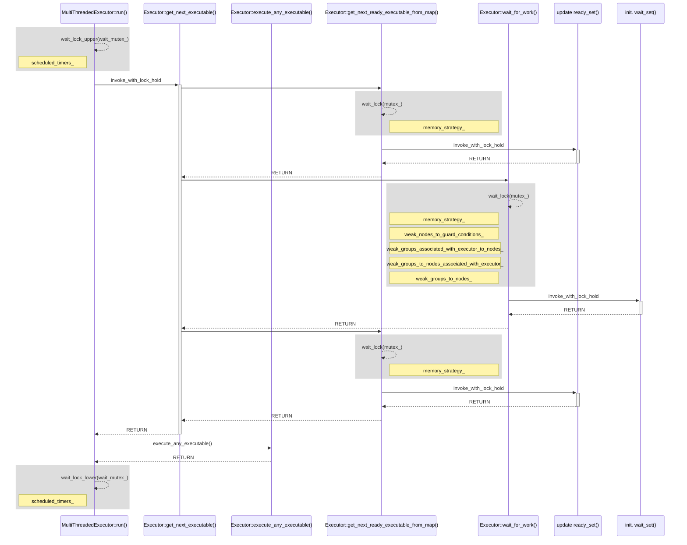

## Some notes

1. `GUARDED_BY` is an attribute on data members, which declares that the data member is protected by the given capability. Read operations on the data require shared access, while write operations require exclusive access.
2. `PT_GUARDED_BY` is similar, but is intended for use on pointers and smart pointers. There is no constraint on the data member itself, but the *data that it points to* is protected by the given capability.
3. `REQUIRES` is an attribute on functions or methods, which declares that the calling thread must have exclusive access to the given capabilities. More than one capability may be specified. The capabilities must be held on entry to the function, *and must still be held on exit*.
4. `REQUIRES_SHARED` is similar, but requires only shared access.

---

1. `get_next_executable(...)`: bool Executor::**get_next_executable**(AnyExecutable & any_executable, std::chrono::nanoseconds timeout)

2. `get_next_ready_executable(...)`: bool Executor::get_next_ready_executable(AnyExecutable & any_executable)

3. `wait_for_work(...)`: void Executor::wait_for_work(std::chrono::nanoseconds timeout)

   

4. ....

